
# 这是一份重要的民间纪事。
【本文来源：微信公众号-少儿贫道。[文章地址](https://mp.weixin.qq.com/s?__biz=MzAxNjY3MDk1MA==&mid=503742491&idx=1&sn=0fe1136a1f40573610da0c4f1f27da7e&chksm=000369923774e084d3e29e1db7ba8995bbbc41203bec5ed54fe05dbe3debe002cf3fe852dbd1&mpshare=1&scene=1&srcid=&sharer_sharetime=1587044136342&sharer_shareid=025dd387619cf7a211f0481d6f9c1ca9&exportkey=A5zbPm4DdnEszZT0XBPP0QA%3D&pass_ticket=2MKj4j35KcHGGR9iRZ5amy6MsejbYax4T9J93yRa94679yD6gl1reSxk9XyJpKFV#rd)】

1月份下旬，出于愤怒的情绪和记录的目的，我保存了一些图片。其实还保存了一些文章，但是后面电脑从装系统，就搞丢了。

如果正统历史是任人打扮的小姑娘，那么做一份野史与之对照，是有必要的。

为了保持客观，本篇不对任何内容做任何评判。

本篇只能提供“时间线”，不指出“谁功谁过，谁该负责”。

注：本篇内容材料十分有限，还有许多已经丢失的东西、没有收集到的东西，仅供参考。

## 2019年12月31
李文亮在微信群发消息，告诉大家有Sars。

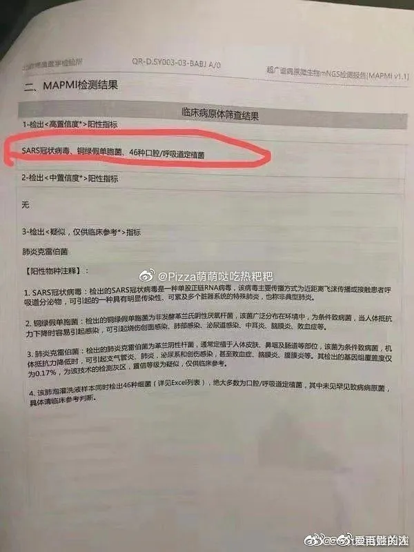

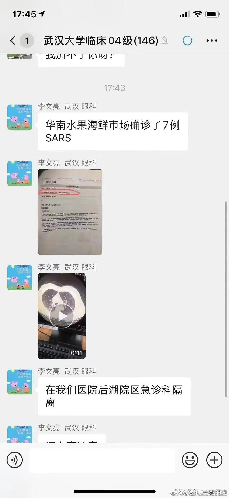

## 2020.1.1

## 2020.1.3

## 1.5
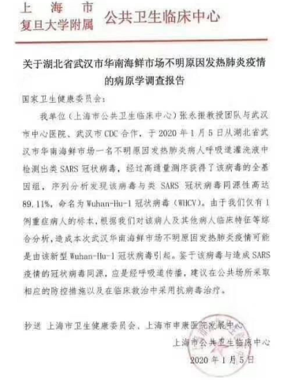

## 1.7

## 1.11

## 1.12

## 1.14
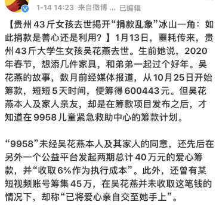

## 1.15
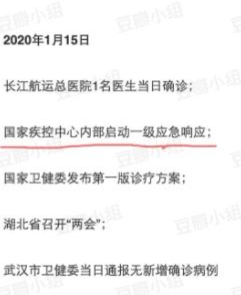

## 1.17

## 1.19

## 1.20

## 1.21

女演员带病表演，传递正能量
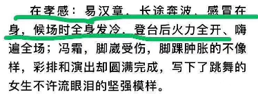

## 1.22

## 1.23
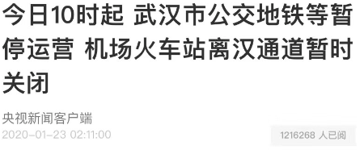

## 1.24除夕夜

## 1.25

## 1.26

## 1.27

## 1.28

## 1.29

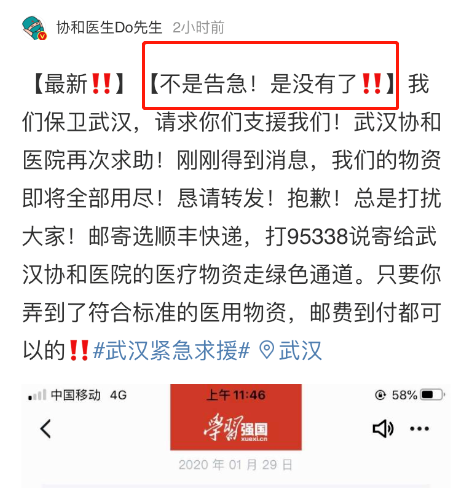

## 1.30

## 1.31

## 2.1

## 2.2

## 2.3
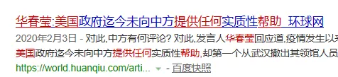

## 2.5

## 2.6

## 2.7
李文亮好友发微博说李文亮2.6日21：30去世，后官方去世时间为2.9日凌晨2：00左右。

## 2.9

## 2.10
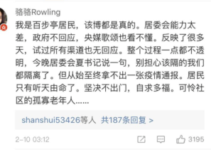

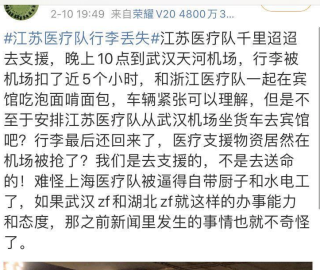

## 2.11

针对征用私人财产，写过一篇文章：[关于政府“可征用私人财产”的分析](https://mp.weixin.qq.com/s?__biz=MzAxNjY3MDk1MA==&mid=2651225951&idx=1&sn=cc335730671f0b44b8b758ebe0362381&chksm=800396d6b7741fc00308aec9d39ecf5594e8c0ea4f40f1934f33cecd6cc406ac8910601c63c6&scene=21#wechat_redirect)。

【对比2.12第一条,这里单价是2元】

## 2.12

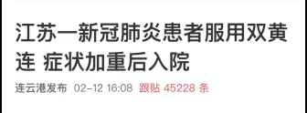

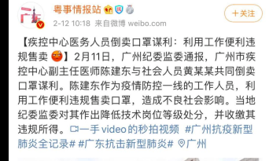

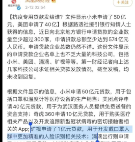

## 2.13

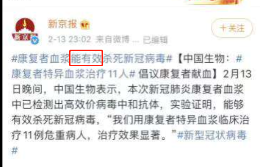

## 2.14

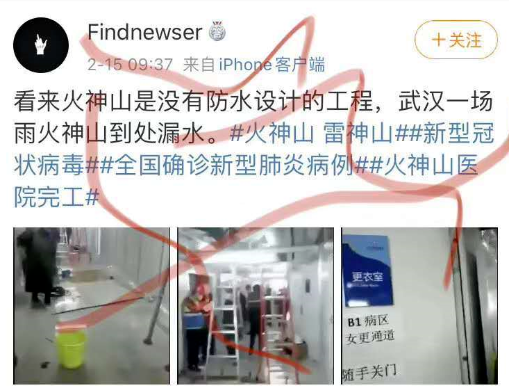

## 3.1新网络法实施

## 3.10
《发哨子的人》在朋友圈以上百种方式流传。
