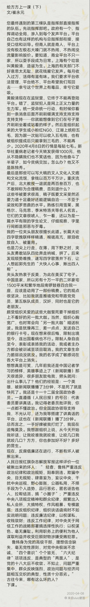

# 給方方上一课

`文/崔永元`

> 原文已被刪;[第三方地址](https://www.xiaxiaoqiang.net/previous-lesson/.html)

## 第一課
應該稱您為老師的，因為是我講課，所以就省了。您不會在意，如果有需要，打死老師也是件有成就的事情，比如當年的宋彬彬。

這堂課我以過來人的身分來講，過來人就是從網絡戰場上死裡逃生的人。可以說，您現在遇到的，我都遇到過。我的判斷是，您現在只是身處戰爭的早期，千萬不要盲目開槍，要節省彈藥。

您現在應該看地圖並且聽取我們這些老戰士的建議，這些建議是用心血換來的。按照研究微觀戰史的規矩，我們稱敵方為對方。

從目前來看，對方是全序列出動了，換句話說，指揮部都上陣了。這一輪干不倒你，就只能動用官方媒體了。我曾有幸一週之內被150多家官方媒體圍毆。除官方媒體外，上述系列分三個梯隊。第一梯隊是地痞流氓，典型代表是司馬三雞。只要有錢，什麼都干。它在微博上的設置都是交錢就可以罵它。

這個梯隊已經喪失了公信力，它們對你的名譽造成不了什麼傷害，重要的是噁心。看著噁心，想起來噁心，心態變壞。韓紅、袁立就是這個樣子，大部分文人也都束手無策。你和它做任何解釋都無意義，你選擇和它對罵，你輸了：「你終於變成了你討厭的那種人」。早年間，北京天津都有混混，都是打出來的。北京是打別人，天津是打自己。往你面碗啐口水，然後說：爺，爺，這都埋汰了，您賞給我吧。

見你家買賣好，穿身厚衣服往你家商號門口躺下，你隨便打，照死裡打。他抱住腦袋扛著，一邊打滾一邊說，舒服，舒服，您再加把勁兒，您老也沒把子力氣喲……打死人你吃官司，打不死你的買賣的收益有它一份兒。

解放後，紅旗一展，我們以為這些混混和煙花兒女一起消失了。其實沒有，它們後繼有人推陳出新，網上稱之為「垃圾人」。如果選擇和垃圾人開戰，必須想明白兩點，一是只有開戰沒有停戰，它們會一輩子粘上你。你願意嗎？你做好準備了嗎？你做任何事情它們都會摻和進來，攪局和拆台，讓你永世不得安寧。二是必須降低身段和格調，使用污言穢語，這是這個戰場通用的武器。

我和網絡大混混方肘子交手時就遇到這個麻煩。中央電視台不允許它的主持人在網上發出獨立的聲音，當然更不允許惡聲惡語，所以單位成了你的負擔，只能辭職。與之交手的所有在職人員都難逃羈絆，在你評職稱的時候、晉級的時候、申請課題的時候……它們都會向你單位成批發來揭發質疑信，組織要調查，你便錯過這次機會。

您不會相信，相當一批科學家因此再不敢惹它們，甚至願意巴結它們。誓死不屈的，如中科院植物研究所傅德志教授，則被折騰的課題組解散，自己患上嚴重精神疾病。

結論是：它們怕沒有單位的人和沒人管的人。

記得我辭職的第二天，一覺醒來，首先想到的是：天哪，我可以罵人了！馬上坐到電腦前大罵一通。以後凡遇記者採訪，總要聲明必須罵人不然不採。你遇到的新問題是你罵不過它們，文人的罵多少講究點文法，也不可僭越底線。它們的罵讓你無法回應……

##第二課

接著講第一梯隊是些什麼人。

本著有困難找警察，我把那些要殺我、殺我妻女、殺我全家的網上歹人報警處理。我記得很清楚，那個想在我演講時給我潑硫酸的是北京大學一個三年級女生。刑警找到她又來找我，聲音很低沉。要帶她來道歉嗎……你接著追究可能會影響她的前途……我知道刑警什麼意思，我說那就算了原諒她吧。今天想來，我就是個傻冒。我們無原則地寬容就是在批量製造人渣。一個可以給人潑硫酸的畢業生，惡毒不會低於他的老師張頤武。

我們屬地派出所民警長途跋涉去了浙江、湖南。北方人受不了南方的陰雨綿綿，凍得發抖。找到兩個渣人，一個身高只有一米四，話說不清楚，另一個住在倉庫裡，守著一台破電腦手拿一瓶酒……他們在網上罵崔永元，有人給它結帳。

最可憐的是民警，每個派出所都是人手有限經費有限。出差辦案吃住還有標準，標準很低。我一個人報的案夠我們管片兒派出所忙活兩三年。另外，我的哥哥就是民警……最後我選擇了撤案，幾十個，都撤了。臨走時我對警察說，放心，我以後再也不報案了。

我就開始啟動訴訟。

前兩天，我問律師，咱們還有多少案子在法院？律師說，大概有20多個吧。請注意我們對話間流露出的散漫隨意。對，法院就是這樣的存在。

法律規定: 民事訴訟法第一百四十九條: 人民法院適用普通程序審理的案件，應當在立案之日起六個月內審結。有特殊情況需要延長的，由本院院長批准，可以延長六個月；還需要延長的，請報請上級人民法院批准。

第一百六十一條：人民法院適用簡易程序審理案件，應當在立案之日起三個月內審結。

換句話說，像我和方方發起的這樣簡單的民事訴訟，應該三個月六個月就見分曉。我只能說，你想多了……被告可以不接傳票或管轄權異議拖延時間。而法院拖延時間的手法可以用花樣百出來形容，一個案子拖上一年、兩年、三年都是小意思，如果你當回事兒你就會精疲力盡，對，我那些案子一個也沒有結案，就像多肉植物一樣擺在法院的窗台上。

我可以預測方方這些案件的判決結果，即，作為公眾人物，因額外占有社會資源，理應受到監督，更應該寬容來自他人的批評。所以方方想得到的讓對方道歉，並獲得經濟補償的想法就很難實現。即便是這個結論，也要等到花兒都謝了。

前兩天，受到中國農業銀行董申污衊的吳小華博士也來請教我，要不要打官司? 我說，你要急於用官司懲戒歹人還自己清白，我看就算了，我保證你睡不著覺掉頭髮心情低落……打官司，又碰上一幫依法辦事的人，是小概率事件。我們打官司，只是想碰碰運氣。從今天開始，方方，忘記你的官司，把它軟埋起來。

方方正在犯著另一個錯誤，向大家解釋那些人是在造謠……多麼徒勞的一件事。它們知道它們在造謠，它們也知道我們知道它們在造謠。它們就喜歡看你祥林嫂一樣，到處說，老子到處說，它們在造謠……我們關愛的芸芸眾生永遠也搞不清楚孰是孰非。

飯桌上，一老兄喝了兩口對我說：我就喜歡你主持的有一說一。我說對不起，我主持的是實話實說(操你大爺馮褲子)。那老兄又說，網上說你爺爺是漢奸，被武工隊抓住綁上石頭沉河裡了……是造謠吧? 我說，網上怎麼會造謠呢? 是真的，我爸也是。到了我這兒又當CCTV著名主持人又是全國政協委員，你說，這TM到哪兒去說理去? 給我也倒一杯，那什麼，你爺爺那哪部分的？

好，現在我們講第二梯隊。成色複雜，僅我遇到的，就有北大張頤武、清華肖鷹、農大何柄生一類的教授，有眾多大學在校學生、有任職期間就開公司的解放軍某部退休副司令員、有開著僚機把長機撞下來的空軍前飛行員、有現任法官和檢察官、有騷氣十足的香港電視台娘們兒、有報社總編輯、有女交警、有科學家有紅二代官二代……他們共同的特徵是腦殘。分成兩撥兒，一撥兒是傻，一撥兒是壞。

不回憶了，每一仗都打得很慘烈！

現在，這個豪華陣容要來對付你方方了，你能應付嗎？你願意為他們耗神耗力虛度年華嗎？

## 第三課

