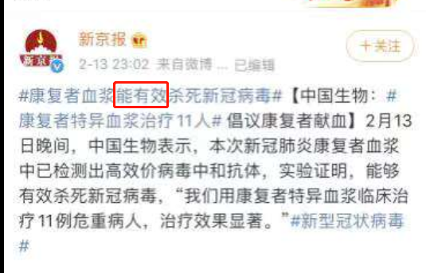
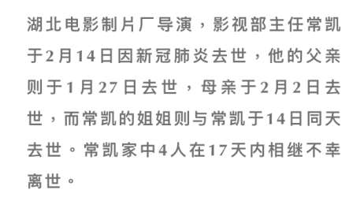
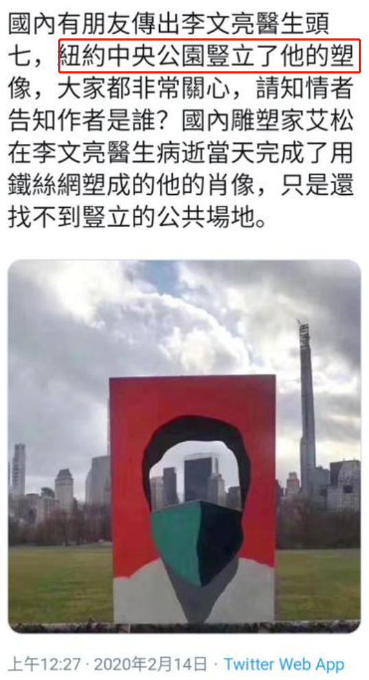
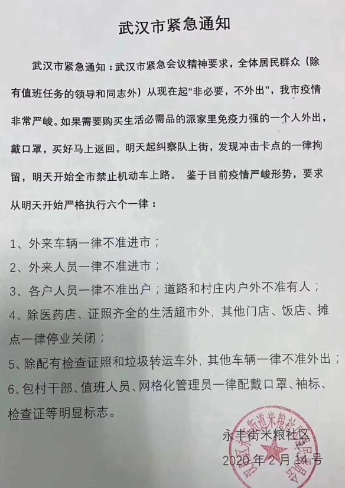

# 这是一份重要的民间纪事。(5)
> [!NOTE]
>本文来源：微信公众号-少儿贫道。[原文章地址](https://mp.weixin.qq.com/s?__biz=MzAxNjY3MDk1MA==&mid=503742491&idx=1&sn=0fe1136a1f40573610da0c4f1f27da7e&chksm=000369923774e084d3e29e1db7ba8995bbbc41203bec5ed54fe05dbe3debe002cf3fe852dbd1&mpshare=1&scene=1&srcid=&sharer_sharetime=1587044136342&sharer_shareid=025dd387619cf7a211f0481d6f9c1ca9&exportkey=A5zbPm4DdnEszZT0XBPP0QA%3D&pass_ticket=2MKj4j35KcHGGR9iRZ5amy6MsejbYax4T9J93yRa94679yD6gl1reSxk9XyJpKFV#rd)

>本文图多，加载较慢，请保持耐心；或直接查看原文

## 2.12

## 2.13

## 2.14

## 3.1新网络法实施

## 3.10
《发哨子的人》在朋友圈以上百种方式流传。

<foot>
<a href="../次生灾难与思考/发哨子的人.md">《发哨子的人》中文版</a>
</foot>
